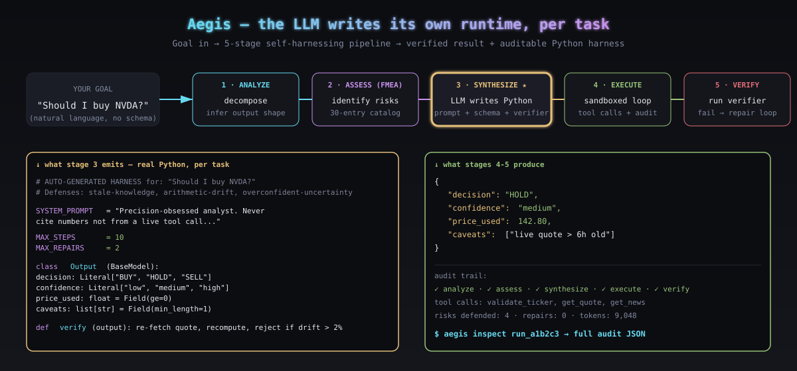

<div align="center">

# Aegis

# In 2027, developers will stop setting up agent harnesses.<br/>The LLM will design its own harness for each unique task.

### Aegis is the open-source implementation of that future. Shipping in 2026.



[](https://pypi.org/project/aegis-harness/)
[](LICENSE)
[](https://www.python.org/downloads/)
[](.github/workflows/test.yml)
[](docs/guides/use-with-your-ai-coding-tool.md)

[**The thesis**](#the-thesis) ·
[**30-second install**](#use-with-your-ai-coding-tool--30-seconds-no-code) ·
[**What the LLM writes**](#what-the-llm-actually-writes) ·
[**Docs**](docs/index.md)

</div>

---

## The thesis

Today, every agent framework — **OpenClaw, Hermes**, LangChain, CrewAI, AutoGen, the OpenAI Assistants API — makes the developer hand-author the harness. You write the system prompt. You write the tool allowlist. You write the output schema. You write the validators. You write the retry policy. You write the sandbox rules. You write it once, and it applies to every task forever after.

That model is about to end.

The next stepping stone toward AGI is agents that:

1. **assess their own task** — what is being asked, where could it go wrong;
2. **predict their own failure modes** — citation hallucination, arithmetic drift, fabricated entities;
3. **write their own runtime harness in real Python** — system prompt, tool allowlist, output schema, post-hoc verifier, retry policy;
4. **execute inside that harness** — sandboxed, audited, verifiable;
5. **return verified results** — or refuse, with a reason.

The developer authors *nothing per-task*. They just state the goal. The LLM designs the harness.

That's Aegis. **A self-harnessing agent framework**, available right now, that plugs into any AI coding tool you already use — Claude Code, Cursor, OpenAI Codex, Cline, Continue, Windsurf, Aider, anything OpenAI-compatible — with one CLI command and zero Python code.

The same goal produces a *different harness* on every run, because the LLM is doing the design work — not a developer staring at a config file.

---

## Use with your AI coding tool — 30 seconds, no code

Aegis ships as a **Model Context Protocol server** and as an **OpenAI-compatible HTTP proxy**. Either way, your existing AI coding assistant gains Aegis's safety pipeline without you writing a line of Python.

### MCP — for Claude Code, Cursor, Cline, Continue, Windsurf

Add this to your tool's MCP config (e.g. `~/.claude/mcp.json` for Claude Code):

```json
{
  "mcpServers": {
    "aegis": {
      "command": "uvx",
      "args": ["aegis-harness", "mcp"],
      "env": {"OPENAI_API_KEY": "sk-..."}
    }
  }
}
```

Restart your tool. It now sees four new tools — `aegis_run`, `aegis_assess`, `aegis_inspect`, `aegis_list_risks` — and can call them whenever it's about to do something risky. Done.

### Proxy — for Cursor, Continue, Aider, Open WebUI, anything OpenAI-compatible

```bash
pip install 'aegis-harness[proxy,openai]'
export OPENAI_API_KEY=sk-...
aegis proxy --port 8000
```

In your tool's settings, change one URL: **`http://localhost:8000/v1`**. Every request now flows through the Aegis pipeline — schema validation, sandboxed verifier, repair loop. Same API, safer outputs.

Copy-paste configs for every supported tool: [docs/guides/use-with-your-ai-coding-tool.md](docs/guides/use-with-your-ai-coding-tool.md).

---

## Quickstart (Python / CLI)

```bash
pip install aegis-harness[all]
export ANTHROPIC_API_KEY=sk-ant-...

aegis run "Find the top 5 startups in YC's W26 batch and verify each URL"
```

```python
import asyncio
from aegis import Aegis

async def main():
    aegis = Aegis()  # auto-detects provider from env
    result = await aegis.run("Find the top 5 startups in YC's W26 batch")
    print(result.value)              # the answer
    print(result.harness_code)       # the Python code Aegis generated
    print(result.audit.risks)        # what could have gone wrong

asyncio.run(main())
```

---

## What the LLM actually writes

Three goals through the same Aegis call. Three structurally different harnesses, all authored by the LLM at the moment the goal arrives:

| Goal | Harness the LLM generates (per-task, automatic) |
|---|---|
| *"Find the top 5 startups in YC's W26 batch"* | Pydantic schema with regex-validated YC URLs + verifier that re-fetches each URL to confirm the startup exists |
| *"Refactor `src/auth.py` to async"* | AST-diff validator + write-allowlist sandbox + test-runner verifier that runs the existing test suite |
| *"Compute MSFT P/E from price and EPS"* | Numeric-bounds schema + arithmetic re-checker that recomputes the answer from `get_quote` data |

A static harness can't do this — its defenses are wrong for at least two of these tasks. Aegis's defenses are different on every run because **the LLM reasoned about what could go wrong for *that specific goal* before executing.**

The 2027 prediction: agents do this for every task, no developer in the loop. Aegis is the working 2026 implementation.

---

## How it works

```
                ┌──────────────────┐
   Your goal ──▶│ 1. ANALYZE       │  Decompose. Infer output shape.
                └────────┬─────────┘
                         ▼
                ┌──────────────────┐
                │ 2. ASSESS (FMEA) │  Where could this hallucinate?
                └────────┬─────────┘  → Risk profile (citation, arithmetic,
                         ▼              prompt-injection, schema drift, …)
                ┌──────────────────┐
                │ 3. SYNTHESIZE    │  Generate REAL Python:
                └────────┬─────────┘  Pydantic schemas, tool guards, verifiers
                         ▼
                ┌──────────────────┐
                │ 4. EXECUTE       │  Run agent inside generated harness.
                └────────┬─────────┘  Sandboxed. Audited.
                         ▼
                ┌──────────────────┐
                │ 5. VERIFY        │  Run synthesized verifiers.
                └────────┬─────────┘  On fail → repair loop.
                         ▼
                Safe result + audit trail + generated harness code
```

### The killer feature: the *entire* runtime is real Python, written by the LLM

A typical Aegis-generated harness for a financial task. Every line below — including the system prompt, the step budget, the tool descriptions — was written by the LLM in response to the goal:

```python
# AUTO-GENERATED HARNESS for: "Should I buy NVDA right now?"
# Defenses:
#   stale-knowledge        -> require live get_quote before any price reasoning
#   citation-hallucination -> regex on filing URLs + post-hoc fetch_url verifier
#   arithmetic-drift       -> recompute price_vs_200dma from raw quote
#   overconfident-uncertainty -> required confidence + caveats fields

from typing import Literal
from pydantic import BaseModel, Field

SYSTEM_PROMPT = (
    "You are a precision-obsessed equity analyst. NEVER cite a number you did "
    "not get from a tool call in this run. NEVER recommend BUY on a stock "
    "without a live quote no older than 1 hour. Show your arithmetic. Refuse "
    "to recommend on incomplete data — say so in caveats."
)
MAX_STEPS = 10
MAX_REPAIRS = 2
TEMPERATURE = 0.0

TOOL_OVERRIDES = {
    "get_quote": "Call FIRST for any price question. Stale price = wrong answer.",
    "validate_ticker": "Call this for ANY ticker the user mentions. If it raises, refuse.",
}

class Output(BaseModel):
    decision: Literal["BUY", "HOLD", "SELL"]
    confidence: Literal["low", "medium", "high"]
    price_used: float = Field(ge=0)
    decision_basis: str = Field(min_length=50)
    caveats: list[str] = Field(min_length=1)

ALLOWED_TOOLS = ["validate_ticker", "get_quote", "get_news"]   # no shell, no write

def verify(output: Output) -> list[str]:
    failures = []
    quote = tool("get_quote", ticker="NVDA")
    if abs(output.price_used - quote["price"]) / quote["price"] > 0.02:
        failures.append(f"price_used {output.price_used} > 2% off live {quote['price']}")
    return failures

def repair_feedback(failures, output):
    return f"Re-fetch the quote and re-derive the decision. Failures: {failures}"
```

That whole module — system prompt to verifier — is what the LLM emitted, validated by the sandbox, and run by a thin interpreter. You can read it, edit it, copy it, save it for next time. **That's what "developer doesn't set up the harness" actually looks like.**

---

## Why this matters

Every conversation about "agent harnesses" today — OpenClaw, Hermes, the dozens of frameworks shipping every month — is about helping developers *write better static harnesses faster*. That's the wrong direction.

The actual frontier is: **agents that don't need a developer-authored harness at all.** They assess the task, anticipate where they'd hallucinate, write the protective scaffold themselves, then execute inside it. The developer just states the goal.

That's the 2027 prediction. Aegis is the working 2026 implementation:

| | Static-harness frameworks (today) | Aegis (this repo) |
|---|---|---|
| Who writes the system prompt? | Developer, once | LLM, per task |
| Who writes the tool allowlist? | Developer, once | LLM, per task |
| Who writes the output schema? | Developer, once | LLM, per task |
| Who writes the verifier? | Developer, once | LLM, per task |
| Who picks the retry policy? | Developer, once | LLM, per task |
| Adapts when the task changes? | No — same harness everywhere | Yes — different harness per task |
| Catches task-specific failure modes? | Only ones you predicted | Whatever the LLM identifies as risky |

A general intelligence can't rely on humans to hand-author defenses for every task. It needs to assess its own competence, anticipate its own failure modes, and engineer the protective scaffold *before* acting — exactly how a careful engineer runs a pre-mortem before shipping code. Aegis is a minimal working prototype of that loop.

Read more: [docs/concepts/why-this-matters-for-agi.md](docs/concepts/why-this-matters-for-agi.md).

---

## What's inside (and why it stays small)

Aegis is intentionally a thin scaffold around the LLM that lets *it* do the design work. Everything per-task is the model's job; everything else is plumbing.

- **5-stage pipeline** — analyze → assess → synthesize → execute → verify (+ repair loop). The pipeline never picks defenses — the LLM does, in stage 3.
- **30-entry risk catalog** — a vocabulary the LLM uses to name failure modes (citation hallucination, arithmetic drift, prompt injection from fetched content, …). Not defenses — *names*. The LLM still writes the defenses.
- **Sandbox for the LLM's generated code** — AST-validated, restricted `__builtins__`, wall-clock + memory limits on `verify()`. No `os`/`subprocess`/network unless the harness explicitly allows it.
- **Multi-provider** — Anthropic / OpenAI / Gemini / Ollama / LiteLLM. The LLM doing the harness design can be Claude on one task, GPT on another, your local Llama on a third.
- **Harness cache** — embedding-indexed memory of past harnesses. Similar goals adapt past defenses. Faster over time.
- **Audit trail per run** — JSON blob of every stage, tool call, repair. `aegis inspect` / `aegis replay`. For compliance + debugging.
- **Two distribution surfaces** — `aegis mcp` (Model Context Protocol server) and `aegis proxy` (OpenAI-compatible HTTP proxy). Any AI coding tool plugs in with zero Python code.
- **Tiny core** — ~3.5k LOC. Read it in an afternoon. Fork it in a weekend.

---

## CLI

```bash
aegis run "your goal here"           # synthesize harness + execute
aegis run --interactive               # REPL mode with live trace
aegis inspect <run-id>                # pretty-print the audit trail
aegis replay <run-id>                 # re-execute against saved harness
aegis cache list                      # list learned harnesses
aegis cache show <hash>               # view a cached harness
aegis serve                           # start the web demo on :8000
aegis bench --quick                   # run 5-task smoke benchmark
aegis bench                           # full 30-task benchmark

# Integration entrypoints (the killer features for AI-tool users):
aegis mcp                             # MCP stdio server (for Claude Code, Cursor, Cline, …)
aegis proxy --port 8000               # OpenAI-compatible HTTP proxy (for any /v1/chat/completions client)
```

---

## Provider matrix

```python
from aegis import Aegis
from aegis.providers import Anthropic, OpenAI, Gemini, Ollama, LiteLLM

Aegis(provider=Anthropic())                          # Claude
Aegis(provider=OpenAI(model="gpt-5.4-nano-2026-03-17"))   # GPT-5.x
Aegis(provider=Gemini(model="gemini-2.5-pro"))       # Google Gemini
Aegis(provider=Ollama(model="llama3.1:70b"))         # local, free
Aegis(provider=LiteLLM(model="bedrock/claude-3"))    # 100+ providers
```

`Aegis()` with no args auto-detects from env in this order: `ANTHROPIC_API_KEY` → `OPENAI_API_KEY` → `GOOGLE_API_KEY` / `GEMINI_API_KEY` → local Ollama → Mock (always works).

---

## Cookbook

| Example | What it shows |
|---|---|
| [01_web_research.py](examples/01_web_research.py) | Citation verifier generated for an open-ended research goal |
| [02_code_refactor.py](examples/02_code_refactor.py) | AST-diff + test-runner harness for a code task |
| [03_data_analysis.py](examples/03_data_analysis.py) | Arithmetic re-checker for a CSV question |
| [04_citation_verifier.py](examples/04_citation_verifier.py) | Deep dive on the citation-hallucination defense |
| [05_custom_provider.py](examples/05_custom_provider.py) | Plug in your own LLM endpoint |
| [06_with_langchain_tools.py](examples/06_with_langchain_tools.py) | Use existing LangChain tools as Aegis tools |
| [07_local_only_with_ollama.py](examples/07_local_only_with_ollama.py) | Fully offline, no API keys |

---

## Benchmarks

30 tasks across web research, code, data analysis, and multi-step planning. Each task is run under three conditions:

1. **Raw LLM** — direct prompt, no guardrails
2. **Fixed harness** — hand-authored guardrails (typical agent framework approach)
3. **Aegis dynamic** — guardrails synthesized per-task

We measure task success, hallucination rate, tokens used, latency, and retry count. See [benchmarks/README.md](benchmarks/README.md) for methodology and current results.

---

## Documentation

- [Concepts → What is a dynamic harness?](docs/concepts/what-is-a-dynamic-harness.md)
- [Concepts → The 5-stage pipeline](docs/concepts/the-5-stage-pipeline.md)
- [Concepts → Why this matters for AGI](docs/concepts/why-this-matters-for-agi.md)
- [Guides → Custom validators](docs/guides/custom-validators.md)
- [Guides → Self-hosting with Ollama](docs/guides/self-hosting-with-ollama.md)
- [API reference](docs/reference/index.md)

Full site: **[jcaiagent7143-ui.github.io/aegis](https://jcaiagent7143-ui.github.io/aegis)** (run `mkdocs serve` locally).

---

## Validating against a real LLM

Don't trust the README — prove it. Set a key and run the one-shot validator:

```bash
export OPENAI_API_KEY=sk-...
export AEGIS_MODEL=gpt-4o-mini          # or gpt-5.4-nano-2026-03-17, gpt-5, etc.
python scripts/run_live.py
```

This runs **7 checks** against the live API: single-turn, multi-turn tool use,
JSON mode, streaming, the full 5-stage pipeline on 3 diverse goals, sandbox
timeout enforcement, and a mini benchmark (raw vs fixed vs Aegis). Exits 0
when everything's green. The same checks run as recorded VCR tests in
`tests/integration/` for CI.

## Status

**v0.2** — Stable beta. Multi-turn tool use verified against real LLMs, sandbox
hardened with wall-clock + memory limits, streaming, retry/rate-limit handling,
VCR integration tests. See [CHANGELOG.md](CHANGELOG.md) for the full v0.1 → v0.2
fix list.

Roadmap:
- v0.3 — Live-streaming web demo UI, multi-agent goals (one harness per sub-agent)
- v0.4 — Self-improving risk catalog (cache learns new failure modes from observed failures)
- v1.0 — Stable API, paper, broad provider parity matrix

---

## Contributing

This is meant to be **the** canonical OSS reference for self-harnessing agents. Issues and PRs are very welcome. Particularly looking for:

- New entries in the risk catalog (failure modes you've actually observed in production)
- Provider adapters
- Cookbook examples in your domain
- Benchmark tasks

See [CONTRIBUTING.md](CONTRIBUTING.md). Look for `good first issue` labels.

---

## Citation

```bibtex
@software{aegis_harness_2026,
  title   = {Aegis: Dynamic, On-The-Fly Generated Harnesses for AI Agents},
  author  = {The Aegis Contributors},
  year    = {2026},
  url     = {https://github.com/jcaiagent7143-ui/aegis},
  version = {0.1.0},
}
```

---

## License

[MIT](LICENSE). Use it for anything.
